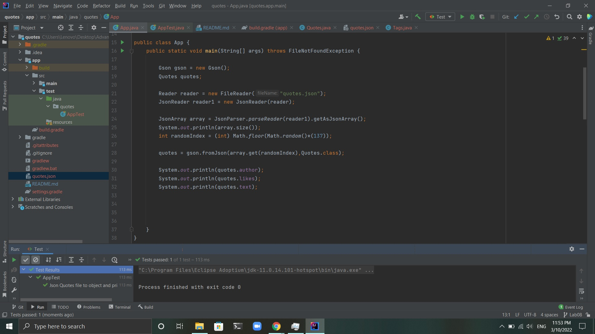

# Quotes

# What my project do
### My project reads the data from a file that contains json data about movie quotes using the Reader class then parse it to an array of objects (Quote). then my code select a random index between 0 and 138 (length of the array) and return the Quote object with that index.After that I print out specific properties as required, these properties is the author,likes and text.  

# Testing
### To test my project you have to change direction  inside quoteApp directory.

# Cloning
### To work on my project after cloning it make sure you have Gson library, if not, add this to your dependencies in the build.gradle file, then click on gradle build button.
### // https://mvnrepository.com/artifact/com.google.code.gson/gson 
### implementation 'com.google.code.gson:gson:2.9.0'

### Important note 
### I am not sure what happend but in intilJ test run correctly but in ubuntu Igot error

